# Approche du Problème - Système de Validation Bancaire Dougs

## 📋 Introduction

Ce document présente ma démarche de réflexion et les choix techniques effectués pour résoudre le problème de validation de l'intégrité des synchronisations bancaires pour Dougs. Il synthétise l'analyse du problème, les décisions d'architecture, et l'algorithme de validation développé.

## 📑 Sommaire

- [📋 Introduction](#-introduction)
- [📊 Visualisation des Diagrammes](#-visualisation-des-diagrammes)
- [🎯 Étape 1 : Compréhension du Problème](#-étape-1--compréhension-du-problème)
  - [1.1 Analyse du Contexte Métier](#11-analyse-du-contexte-métier)
  - [1.2 Identification des Exigences](#12-identification-des-exigences)
  - [1.3 Contraintes Identifiées](#13-contraintes-identifiées)
- [🔍 Étape 2 : Analyse Technique du Problème](#-étape-2--analyse-technique-du-problème)
  - [2.1 Décomposition du Problème](#21-décomposition-du-problème)
  - [2.2 Réflexion sur la Validation des Soldes](#22-réflexion-sur-la-validation-des-soldes)
  - [2.3 Réflexion sur la Détection de Doublons](#23-réflexion-sur-la-détection-de-doublons)
  - [2.4 Réflexion sur la Détection de Transactions Manquantes](#24-réflexion-sur-la-détection-de-transactions-manquantes)
- [🏗️ Étape 3 : Choix d'Architecture](#️-étape-3--choix-darchitecture)
  - [3.1 Structure du Code](#31-structure-du-code)
  - [3.2 Structure des Réponses](#32-structure-des-réponses)
- [🧮 Étape 4 : Algorithme de Validation](#-étape-4--algorithme-de-validation)
  - [4.1 Vue d'Ensemble](#41-vue-densemble)
  - [4.2 Détails de l'Implémentation](#42-détails-de-limplémentation)
  - [4.3 Gestion des Cas Limites](#43-gestion-des-cas-limites)
- [🎨 Étape 5 : Décisions de Design](#-étape-5--décisions-de-design)
  - [5.1 Détection de Doublons : Pourquoi Levenshtein ?](#51-détection-de-doublons--pourquoi-levenshtein-)
  - [5.2 Validation du Premier Point : Pourquoi Solde Initial = 0 ?](#52-validation-du-premier-point--pourquoi-solde-initial--0-)
  - [5.3 Structure des Détails d'Erreur](#53-structure-des-détails-derreur)
- [🧪 Étape 6 : Tests et Validation](#-étape-6--tests-et-validation)
  - [6.1 Stratégie de Test](#61-stratégie-de-test)
  - [6.2 Cas de Test Couverts](#62-cas-de-test-couverts)
- [🔄 Étape 7 : Itérations et Améliorations](#-étape-7--itérations-et-améliorations)
  - [7.1 Problèmes Identifiés et Corrigés](#71-problèmes-identifiés-et-corrigés)
  - [7.2 Améliorations Futures Possibles](#72-améliorations-futures-possibles)
- [📊 Étape 8 : Résultats et Validation](#-étape-8--résultats-et-validation)
  - [8.1 Fonctionnalités Implémentées](#81-fonctionnalités-implémentées)
  - [8.2 Qualité du Code](#82-qualité-du-code)
  - [8.3 Conformité aux Exigences](#83-conformité-aux-exigences)
- [🎓 Conclusion](#-conclusion)
  - [Points Clés de l'Approche](#points-clés-de-lapproche)
  - [Apprentissages](#apprentissages)
  - [Perspectives](#perspectives)

---

## 📊 Visualisation des Diagrammes

Ce document contient des diagrammes Mermaid pour améliorer la lisibilité. Voici comment les visualiser :

### ✅ Support Natif (sans plugin)

- **GitHub / GitLab** : Les diagrammes Mermaid sont rendus automatiquement lors de la visualisation sur GitHub/GitLab
- **Cursor / VS Code** : Si vous utilisez Cursor ou VS Code, installez l'une des extensions recommandées (voir ci-dessous)

### 🔌 Extensions Recommandées pour Cursor/VS Code

Le fichier `.vscode/extensions.json` contient les extensions recommandées. Vous pouvez les installer via :

1. **Via l'interface** : Cursor/VS Code vous proposera automatiquement d'installer les extensions recommandées
2. **Manuellement** : Recherchez dans les extensions :
   - `Markdown Preview Mermaid Support` (bierner.markdown-mermaid)
   - `Mermaid Markdown Syntax Highlighting` (bpruitt-goddard.mermaid-markdown-syntax-highlighting)

### 📱 Autres Options

- **Obsidian** : Support natif de Mermaid
- **Notion** : Support natif de Mermaid
- **Typora** : Nécessite un plugin
- **En ligne** : Utilisez [Mermaid Live Editor](https://mermaid.live/) pour copier-coller les diagrammes

### 🖼️ Version avec Images

Si vous avez besoin d'une version avec des images PNG/SVG des diagrammes, consultez le dossier `documentation/images/` (généré si nécessaire).

---

## 🎯 Étape 1 : Compréhension du Problème

### 1.1 Analyse du Contexte Métier

**Problème identifié** :

- Les prestataires externes utilisent du scraping pour récupérer les transactions bancaires
- Cette technique n'est pas fiable à 100% : risques de doublons et de transactions manquantes
- Impact critique : une comptabilité faussée peut avoir des conséquences graves pour les clients

**Solution de contrôle existante** :

- Les clients fournissent leurs relevés bancaires avec des points de contrôle (soldes en fin de période)
- Les soldes des relevés sont considérés comme justes et fiables
- Un comptable effectue un contrôle manuel en cas d'anomalie

**Objectif** :

- Automatiser la détection des anomalies pour simplifier le travail du comptable
- Fournir des informations précises pour faciliter la correction manuelle

#### Flux du Problème

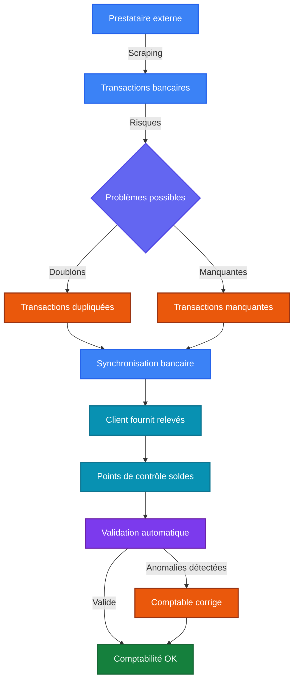

### 1.2 Identification des Exigences

**Fonctionnelles** :

1. Valider que les soldes aux points de contrôle correspondent aux mouvements
2. Détecter les transactions dupliquées
3. Identifier les transactions manquantes potentielles
4. Fournir des messages d'erreur détaillés et actionnables

**Non-fonctionnelles** :

- API REST simple et claire
- Réponses structurées avec détails suffisants
- Code maintenable et testable
- Performance acceptable pour des volumes raisonnables

### 1.3 Contraintes Identifiées

- **Solde initial inconnu** : On ne connaît pas le solde de départ du compte
- **Relevés non mensuels** : Les points de contrôle peuvent être à des intervalles variables
- **Fiabilité des relevés** : Les soldes des relevés sont considérés comme justes (postulat métier)
- **Simplicité pour le comptable** : Les messages doivent être clairs et actionnables

---

## 🔍 Étape 2 : Analyse Technique du Problème

### 2.1 Décomposition du Problème

J'ai décomposé le problème en sous-problèmes distincts :

1. **Validation des soldes** : Comment valider sans connaître le solde initial ?
2. **Détection de doublons** : Comment identifier des transactions similaires mais pas identiques ?
3. **Détection de transactions manquantes** : Comment détecter ce qui manque sans avoir la référence complète ?
4. **Structure des réponses** : Comment fournir des informations utiles au comptable ?

#### Décomposition du Problème

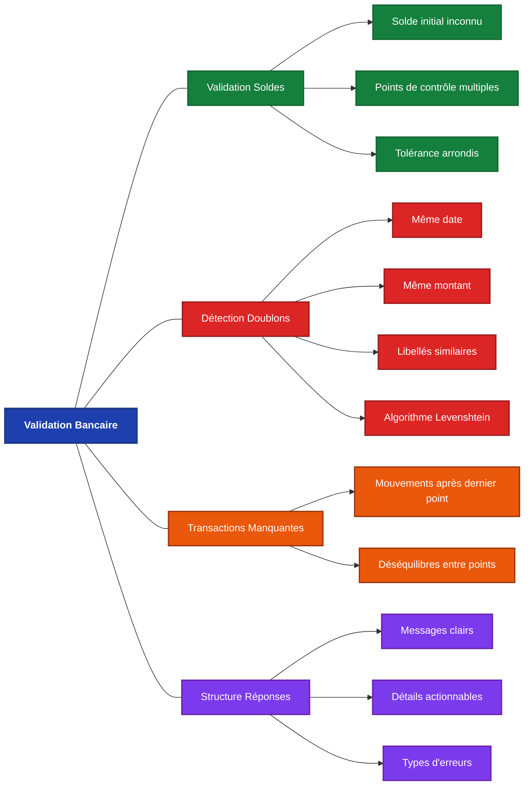

### 2.2 Réflexion sur la Validation des Soldes

**Problème central** : Comment valider les soldes sans connaître le solde initial ?

**Approche retenue** :

1. **Pour le premier point de contrôle** :
   - Si des mouvements existent avant le premier point, on peut supposer un solde initial de 0
   - Validation : `PremierSolde = 0 + Somme(Mouvements jusqu'au premier point)`
   - Cette approche permet de détecter les erreurs au premier point

2. **Pour les points suivants** :
   - Utilisation du point précédent comme référence
   - Validation : `SoldeActuel = SoldePrécédent + Somme(Mouvements dans la période)`
   - Cette approche ne nécessite pas de connaître le solde initial

**Décision** : Utiliser une tolérance de 0.01 pour gérer les erreurs d'arrondi en virgule flottante.

#### Algorithme de Validation des Soldes

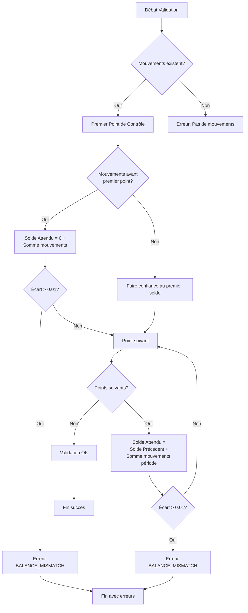

### 2.3 Réflexion sur la Détection de Doublons

**Problème** : Les doublons peuvent avoir des libellés légèrement différents (espaces, caractères spéciaux, variations mineures).

**Approche retenue** :

1. **Critères de groupement** :
   - Même date (comparaison au jour près)
   - Même montant (comparaison exacte)

2. **Comparaison des libellés** :
   - Normalisation : minuscules, suppression des caractères spéciaux, normalisation des espaces
   - Similarité : utilisation de la distance de Levenshtein avec un seuil de 80%
   - Cas spéciaux : détection si un libellé contient l'autre (ex: "PAYMENT" vs "PAYMENT REF 123")

**Décision** : Utiliser un algorithme multi-critères pour éviter les faux positifs tout en détectant les vrais doublons.

#### Processus de Détection de Doublons

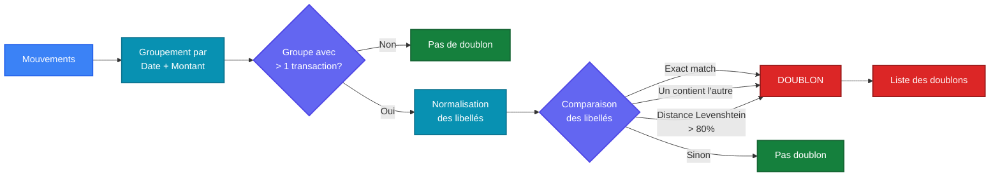

### 2.4 Réflexion sur la Détection de Transactions Manquantes

**Problème** : On ne peut pas détecter directement ce qui manque, mais on peut identifier des incohérences.

**Approche retenue** :

1. **Mouvements après le dernier point de contrôle** :
   - Signale qu'il manque peut-être des points de contrôle
   - Ou qu'il y a des transactions non couvertes par la période de validation

2. **Déséquilibres entre points de contrôle** :
   - Si le solde ne correspond pas, cela peut indiquer des transactions manquantes
   - Mais cela peut aussi indiquer des doublons ou des erreurs de solde

**Décision** : Se concentrer sur les cas évidents (mouvements après le dernier point) et laisser le comptable analyser les déséquilibres.

#### Processus de Détection de Transactions Manquantes

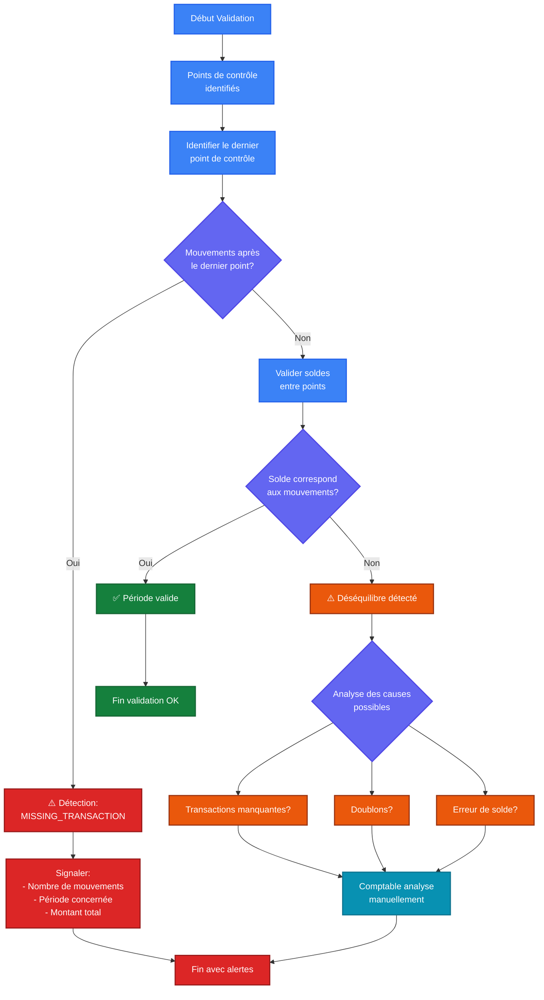

---

## 🏗️ Étape 3 : Choix d'Architecture

### 3.1 Structure du Code

**Organisation choisie** :

```
src/
├── movements/
│   ├── movements.controller.ts    # Point d'entrée HTTP
│   ├── movements.service.ts        # Logique métier
│   └── dto/
│       ├── validation-request.dto.ts   # Validation des entrées
│       └── validation-response.dto.ts  # Structure des réponses
```

**Justification** :

- **Controller** : Gère uniquement les aspects HTTP (routing, codes de statut)
- **Service** : Contient toute la logique métier, facilement testable
- **DTOs** : Validation et typage des données d'entrée/sortie

#### Architecture du Système

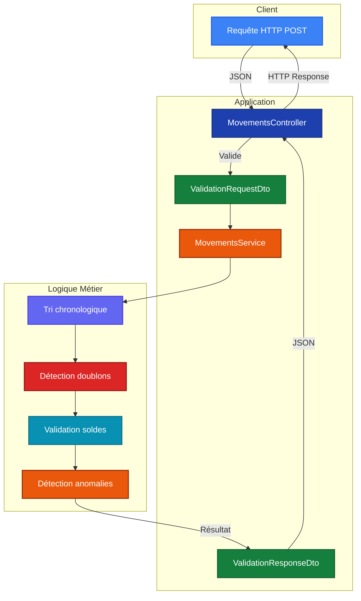

### 3.2 Structure des Réponses

**Design choisi** :

```typescript
{
  message: "Validation failed" | "Accepted",
  reasons?: [{
    type: "BALANCE_MISMATCH" | "DUPLICATE_TRANSACTION" | ...,
    message: string,
    details: { ... }
  }]
}
```

**Justification** :

- **Message clair** : Le comptable sait immédiatement si c'est valide ou non
- **Raisons structurées** : Chaque type d'erreur a ses propres détails
- **Détails actionnables** : Informations suffisantes pour corriger le problème

---

## 🧮 Étape 4 : Algorithme de Validation

### 4.1 Vue d'Ensemble

L'algorithme suit un ordre logique pour détecter tous les types d'anomalies :

```
1. Préparation des données (tri chronologique)
2. Validation de l'ordre des points de contrôle
3. Détection de doublons
4. Validation des soldes (premier point puis points suivants)
5. Détection de mouvements après le dernier point
```

#### Flux Principal de Validation

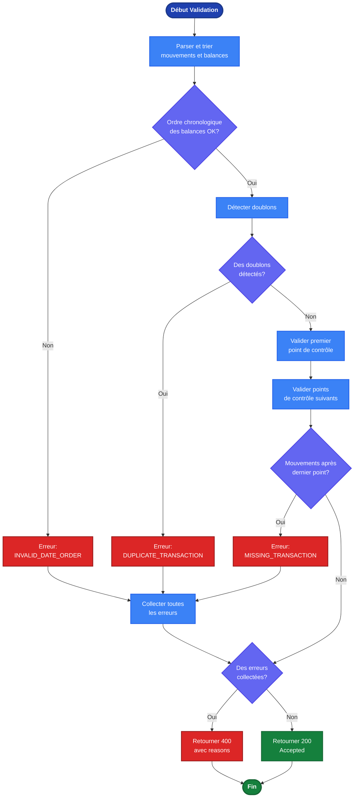

### 4.2 Détails de l'Implémentation

#### Phase 1 : Préparation

- Tri chronologique des mouvements et des balances
- Parsing des dates en objets Date pour comparaisons fiables
- Validation de l'ordre chronologique des points de contrôle

#### Phase 2 : Détection de Doublons

1. Groupement par date et montant
2. Pour chaque groupe, comparaison des libellés normalisés
3. Utilisation de la distance de Levenshtein pour la similarité
4. Ajout des transactions similaires à la liste des doublons

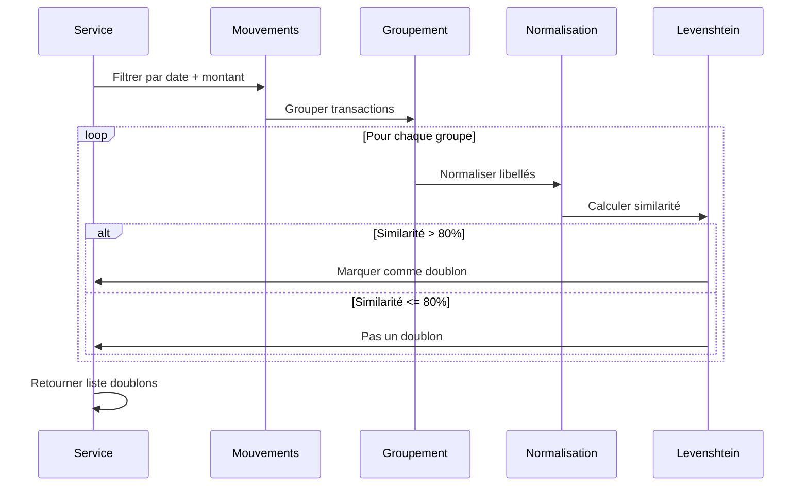

#### Phase 3 : Validation des Soldes

1. **Premier point** :

   ```typescript
   if (mouvements jusqu'au premier point) {
     soldeAttendu = 0 + somme(mouvements jusqu'au premier point)
     if (|soldeAttendu - soldeRelevé| > tolérance) {
       erreur BALANCE_MISMATCH
     }
   }
   ```

2. **Points suivants** :
   ```typescript
   for (chaque point suivant) {
     mouvementsDansPériode = mouvements entre point précédent et point actuel
     soldeAttendu = soldePrécédent + somme(mouvementsDansPériode)
     if (|soldeAttendu - soldeRelevé| > tolérance) {
       erreur BALANCE_MISMATCH
     }
   }
   ```

#### Phase 4 : Détection d'Anomalies Temporelles

- Détection des mouvements après le dernier point de contrôle
- Signalement avec le montant total et la période concernée

### 4.3 Gestion des Cas Limites

**Cas traités** :

- ✅ Mouvements vides avec balances
- ✅ Balances vides avec mouvements
- ✅ Dates identiques (mouvement le même jour qu'un point de contrôle)
- ✅ Un seul point de contrôle
- ✅ Plusieurs points de contrôle
- ✅ Erreurs d'arrondi (tolérance de 0.01)

---

## 🎨 Étape 5 : Décisions de Design

### 5.1 Détection de Doublons : Pourquoi Levenshtein ?

**Alternatives considérées** :

1. Comparaison exacte des libellés → Trop strict, manque les variations
2. Comparaison par mots-clés → Complexe, risque de faux positifs
3. Distance de Levenshtein → Bon compromis précision/flexibilité

**Choix** : Distance de Levenshtein avec seuil de 80% car :

- Détecte les variations mineures (typos, espaces)
- Évite les faux positifs (seuil assez élevé)
- Algorithme classique et bien compris

#### Comparaison des Approches

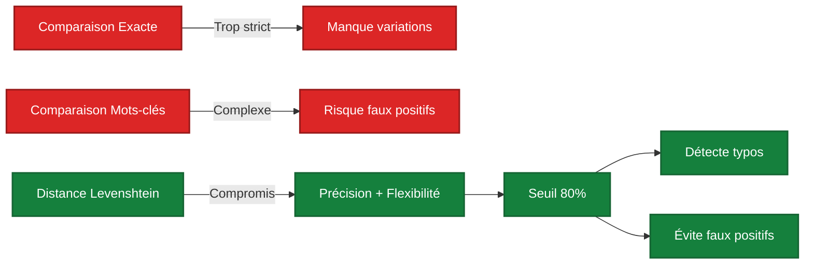

### 5.2 Validation du Premier Point : Pourquoi Solde Initial = 0 ?

**Réflexion** :

- On ne connaît pas le solde initial réel
- Mais si des mouvements existent avant le premier point, on peut supposer 0
- Si le premier solde est correct, il devrait égaler la somme des mouvements (solde initial = 0)

**Justification** :

- C'est une hypothèse raisonnable pour la validation
- Si le solde initial n'est pas 0, le premier point devrait le refléter
- Cette approche permet de détecter les erreurs au premier point

#### Logique de Validation du Premier Point

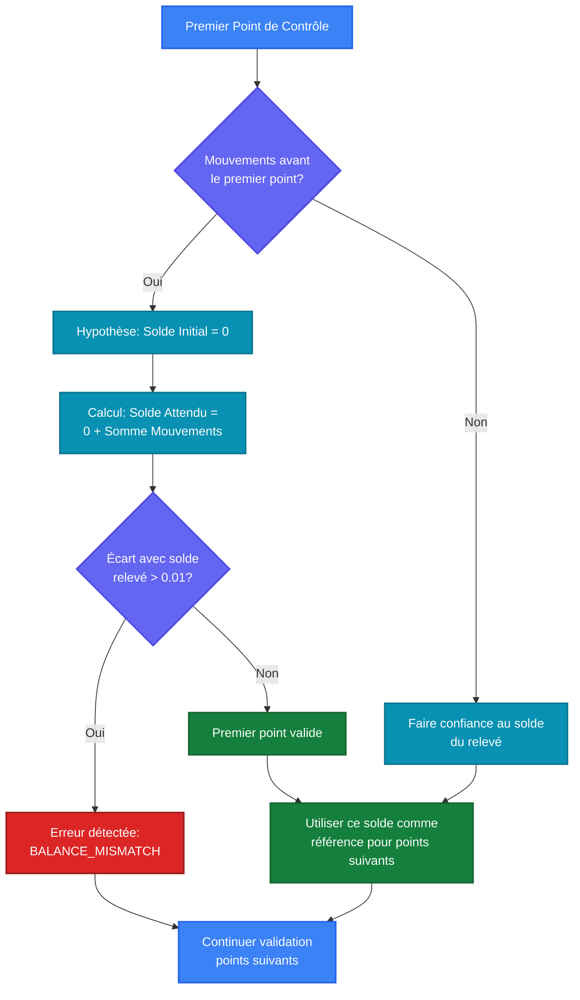

### 5.3 Structure des Détails d'Erreur

**Design choisi** :

- `expectedBalance` : Solde calculé (ce qu'on attend)
- `actualBalance` : Solde du relevé (ce qu'on a reçu)
- `difference` : Différence entre les deux

**Justification** :

- Noms clairs et explicites
- Permet au comptable de comprendre rapidement le problème
- Facilite le calcul manuel de correction

---

## 🧪 Étape 6 : Tests et Validation

### 6.1 Stratégie de Test

**Tests unitaires** :

- Validation réussie
- Détection de déséquilibre de solde
- Détection de doublons
- Détection de mouvements après le dernier point
- Validation du premier point de contrôle

**Tests d'intégration** :

- Exemples fournis dans `/examples` pour validation manuelle
- Tests HTTP avec les différents cas d'usage

### 6.2 Cas de Test Couverts

1. **Cas valide** : Tous les soldes correspondent
2. **Déséquilibre** : Solde incorrect au premier point
3. **Doublons** : Transactions dupliquées détectées
4. **Mouvements après** : Transactions après le dernier point
5. **Points multiples** : Validation de plusieurs points de contrôle

---

## 🔄 Étape 7 : Itérations et Améliorations

### 7.1 Problèmes Identifiés et Corrigés

**Problème 1 : Premier point non validé**

- **Détection** : Analyse du code et tests
- **Correction** : Ajout de la validation du premier point avec solde initial = 0
- **Impact** : Détection des erreurs au premier point de contrôle

**Problème 2 : Labels inversés dans les erreurs**

- **Détection** : Analyse de la cohérence des messages
- **Correction** : Inversion des labels `expectedBalance` et `actualBalance`
- **Impact** : Messages d'erreur plus clairs pour le comptable

### 7.2 Améliorations Futures Possibles

1. **Détection intelligente de transactions manquantes** :
   - Analyser les patterns pour détecter des périodes suspectes
   - Comparer avec des données historiques si disponibles

2. **Groupement des doublons** :
   - Au lieu de lister tous les doublons, les grouper par similarité
   - Faciliter l'analyse pour le comptable

3. **Statistiques de validation** :
   - Ajouter des métriques (nombre de mouvements, période couverte)
   - Aider à comprendre le contexte de la validation

---

## 📊 Étape 8 : Résultats et Validation

### 8.1 Fonctionnalités Implémentées

✅ Validation des soldes aux points de contrôle  
✅ Détection de doublons avec similarité de libellés  
✅ Détection de mouvements après le dernier point  
✅ Validation de l'ordre chronologique  
✅ Messages d'erreur détaillés et actionnables  
✅ API REST conforme aux spécifications

### 8.2 Qualité du Code

- **Architecture** : Modulaire et maintenable
- **Tests** : Couverture des cas principaux
- **Documentation** : README et exemples fournis
- **TypeScript** : Typage fort pour la sécurité

### 8.3 Conformité aux Exigences

| Exigence                          | Statut | Commentaire                     |
| --------------------------------- | ------ | ------------------------------- |
| API POST /movements/validation    | ✅     | Implémenté                      |
| Réponse 2XX pour succès           | ✅     | Code 200                        |
| Réponse 4XX avec reasons          | ✅     | Code 400 avec détails           |
| Détection de doublons             | ✅     | Algorithme Levenshtein          |
| Validation des soldes             | ✅     | Premier point + points suivants |
| Simplification du contrôle manuel | ✅     | Messages détaillés              |

#### Diagramme de Conformité

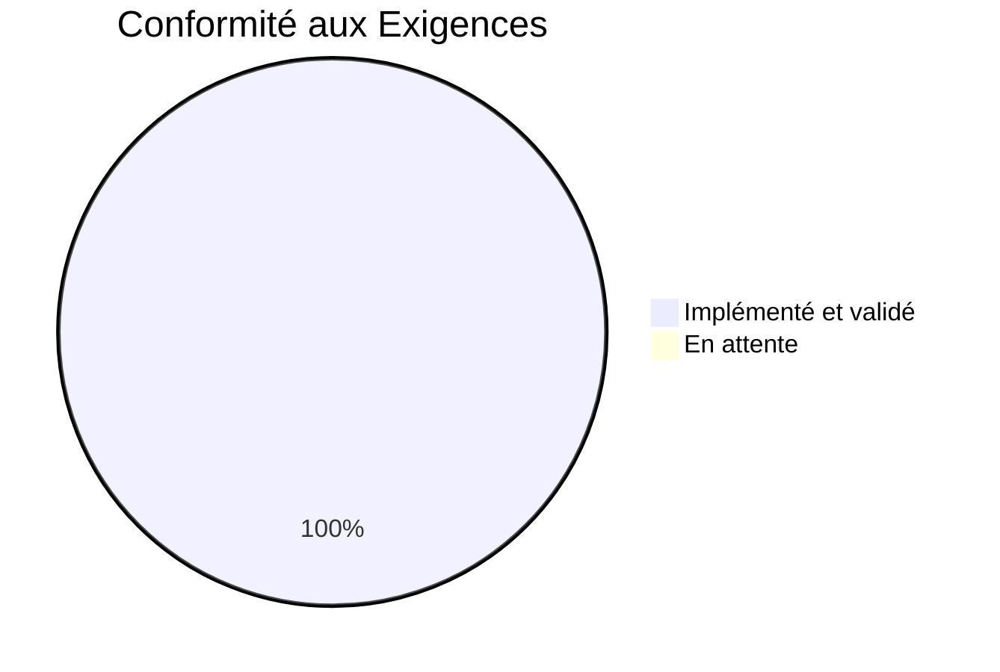

---

## ⚡ Étape 9 : Analyse de Complexité Algorithmique

Cette section détaille la complexité temporelle et spatiale de chaque grande étape de l'algorithme de validation. Cette analyse permet de comprendre les performances attendues et d'identifier les éventuels goulots d'étranglement.

### 9.1 Notations Utilisées

- **n** : Nombre de mouvements bancaires
- **m** : Nombre de points de contrôle (balances)
- **b** : Nombre de balances (b = m)
- **l** : Longueur moyenne des libellés de transactions
- **k** : Taille d'un groupe de transactions potentielles (pour la détection de doublons)

### 9.2 Vue d'Ensemble de la Complexité

L'algorithme principal `validateMovements` a une complexité globale de :

- **Complexité temporelle** : O(n log n + m log m + n² × l + b × n)
- **Complexité spatiale** : O(n + m)

#### Décomposition par Phase

```mermaid
graph TD
    A[validateMovements]:::rootStyle --> B[Parse & Sort Movements<br/>O(n log n)]:::parseStyle
    A --> C[Parse & Sort Balances<br/>O(m log m)]:::parseStyle
    A --> D[Validate Date Order<br/>O(m)]:::validateStyle
    A --> E[Detect Duplicates<br/>O(n² × l)]:::duplicateStyle
    A --> F[Validate Balances<br/>O(b × n)]:::balanceStyle

    B --> G[Total: O(n log n + m log m + n² × l + b × n)]:::totalStyle
    C --> G
    D --> G
    E --> G
    F --> G

    classDef rootStyle fill:#1e40af,stroke:#1e3a8a,stroke-width:3px,color:#ffffff,font-weight:bold
    classDef parseStyle fill:#3b82f6,stroke:#2563eb,stroke-width:2px,color:#ffffff
    classDef validateStyle fill:#15803d,stroke:#166534,stroke-width:2px,color:#ffffff
    classDef duplicateStyle fill:#dc2626,stroke:#991b1b,stroke-width:2px,color:#ffffff
    classDef balanceStyle fill:#ea580c,stroke:#9a3412,stroke-width:2px,color:#ffffff
    classDef totalStyle fill:#7c3aed,stroke:#6b21a8,stroke-width:3px,color:#ffffff,font-weight:bold
```

### 9.3 Détail par Fonction Utilitaire

#### 9.3.1 Parsing et Tri des Données

**Fonctions** : `parseAndSortMovements`, `parseAndSortBalances`

| Fonction                   | Complexité Temporelle | Complexité Spatiale | Justification                  |
| -------------------------- | --------------------- | ------------------- | ------------------------------ |
| `parseAndSortMovements`    | O(n log n)            | O(n)                | Parsing O(n) + Tri O(n log n)  |
| `parseAndSortBalances`     | O(m log m)            | O(m)                | Parsing O(m) + Tri O(m log m)  |
| `validateBalanceDateOrder` | O(m)                  | O(1)                | Parcours linéaire des balances |

**Détails** :

- Le parsing nécessite de créer un nouvel objet pour chaque mouvement/balance : O(n) ou O(m)
- Le tri utilise l'algorithme natif de JavaScript (Timsort) : O(n log n) ou O(m log m)
- La validation de l'ordre chronologique est un simple parcours linéaire

#### 9.3.2 Détection de Doublons

**Fonction principale** : `detectDuplicates`

| Étape                       | Complexité Temporelle | Complexité Spatiale | Justification                                               |
| --------------------------- | --------------------- | ------------------- | ----------------------------------------------------------- |
| Groupement par date+montant | O(n)                  | O(n)                | Parcours linéaire avec Map                                  |
| Comparaison des libellés    | O(k² × l) par groupe  | O(k)                | Comparaison paire-à-paire avec Levenshtein                  |
| **Total (cas moyen)**       | O(n² × l)             | O(n)                | Dans le pire cas, tous les mouvements ont même date+montant |
| **Total (cas optimal)**     | O(n × l)              | O(n)                | Si peu de groupes avec k=1 ou k=2                           |

**Fonctions utilitaires** :

| Fonction              | Complexité Temporelle       | Complexité Spatiale | Justification                                   |
| --------------------- | --------------------------- | ------------------- | ----------------------------------------------- |
| `normalizeLabel`      | O(l)                        | O(l)                | Parcours de la chaîne + remplacements           |
| `levenshteinDistance` | O(l₁ × l₂)                  | O(l₁ × l₂)          | Matrice de taille l₁ × l₂                       |
| `calculateSimilarity` | O(l₁ × l₂)                  | O(l₁ × l₂)          | Appelle Levenshtein                             |
| `areLabelsSimilar`    | O(min(l₁, l₂)) à O(l₁ × l₂) | O(l₁ × l₂)          | Contient check O(min) ou Levenshtein O(l₁ × l₂) |

**Détails** :

- Le groupement crée une Map avec clé `date_amount` : O(n) en temps et espace
- Pour chaque groupe de taille k, on compare toutes les paires : O(k²)
- Chaque comparaison utilise Levenshtein : O(l₁ × l₂) où l₁ et l₂ sont les longueurs des libellés
- Dans le pire cas (tous les mouvements ont même date+montant), k = n, donc O(n² × l)

#### 9.3.3 Validation des Balances

**Fonctions principales** : `validateFirstBalance`, `validateSubsequentBalances`, `checkMovementsAfterLastBalance`

| Fonction                         | Complexité Temporelle | Complexité Spatiale | Justification                    |
| -------------------------------- | --------------------- | ------------------- | -------------------------------- |
| `filterMovementsUpToDate`        | O(n)                  | O(k) où k ≤ n       | Filtrage linéaire                |
| `filterMovementsBetweenDates`    | O(n)                  | O(k) où k ≤ n       | Filtrage linéaire                |
| `sumMovementAmounts`             | O(k)                  | O(1)                | Réduction linéaire               |
| `validateFirstBalance`           | O(n)                  | O(k) où k ≤ n       | Filtrage + somme                 |
| `validateSubsequentBalances`     | O(b × n)              | O(n)                | Pour chaque balance, filtre O(n) |
| `checkMovementsAfterLastBalance` | O(n)                  | O(k) où k ≤ n       | Filtrage linéaire                |

**Détails** :

- `validateFirstBalance` : Filtre les mouvements jusqu'au premier point O(n), puis somme O(k)
- `validateSubsequentBalances` : Pour chaque balance (b itérations), filtre les mouvements de la période O(n)
- Dans le pire cas, chaque période contient tous les mouvements, donc O(b × n)
- En pratique, les mouvements sont répartis entre les périodes, donc souvent meilleur

### 9.4 Analyse Globale

#### Cas Typique (n = 1000, m = 12, l = 20)

| Phase                  | Complexité                    | Temps Estimé | Mémoire Estimée |
| ---------------------- | ----------------------------- | ------------ | --------------- |
| Parse & Sort Movements | O(1000 log 1000) ≈ O(10,000)  | ~1ms         | ~100KB          |
| Parse & Sort Balances  | O(12 log 12) ≈ O(43)          | ~0.01ms      | ~1KB            |
| Validate Date Order    | O(12)                         | ~0.001ms     | ~0.1KB          |
| Detect Duplicates      | O(1000² × 20) ≈ O(20,000,000) | ~200ms       | ~200KB          |
| Validate Balances      | O(12 × 1000) ≈ O(12,000)      | ~1ms         | ~100KB          |
| **Total**              | **O(20,012,043)**             | **~202ms**   | **~401KB**      |

#### Cas Extrême (n = 100,000, m = 100, l = 50)

| Phase                  | Complexité                            | Temps Estimé   | Mémoire Estimée |
| ---------------------- | ------------------------------------- | -------------- | --------------- |
| Parse & Sort Movements | O(100,000 log 100,000) ≈ O(1,660,000) | ~166ms         | ~10MB           |
| Parse & Sort Balances  | O(100 log 100) ≈ O(664)               | ~0.1ms         | ~10KB           |
| Validate Date Order    | O(100)                                | ~0.01ms        | ~1KB            |
| Detect Duplicates      | O(100,000² × 50) ≈ O(500,000,000,000) | ~5000s (83min) | ~50MB           |
| Validate Balances      | O(100 × 100,000) ≈ O(10,000,000)      | ~1s            | ~10MB           |
| **Total**              | **O(500,011,660,664)**                | **~5000s**     | **~70MB**       |

⚠️ **Note** : La détection de doublons devient le goulot d'étranglement pour de gros volumes.

### 9.5 Optimisations Possibles

#### 9.5.1 Détection de Doublons

**Problème actuel** : O(n² × l) dans le pire cas

**Optimisations possibles** :

1. **Indexation par hash** : Utiliser un hash des libellés normalisés pour réduire les comparaisons
   - Complexité : O(n × l) en moyenne
   - Espace : O(n)

2. **Early exit** : Arrêter la comparaison Levenshtein si la distance dépasse le seuil
   - Réduit le facteur constant, mais pas la complexité asymptotique

3. **Parallélisation** : Traiter les groupes en parallèle
   - Complexité : O(n² × l / p) où p est le nombre de processeurs
   - Nécessite une architecture adaptée

#### 9.5.2 Validation des Balances

**Problème actuel** : O(b × n) car on filtre tous les mouvements pour chaque balance

**Optimisation possible** :

1. **Indexation par date** : Créer un index des mouvements par date
   - Complexité : O(n log n) pour l'index + O(b × log n) pour les recherches
   - Espace : O(n)
   - Gain : O(b × n) → O(n log n + b × log n)

### 9.6 Résumé des Complexités

#### Tableau Récapitulatif

| Fonction                         | Complexité Temporelle                     | Complexité Spatiale | Dominateur               |
| -------------------------------- | ----------------------------------------- | ------------------- | ------------------------ |
| `parseAndSortMovements`          | O(n log n)                                | O(n)                | Tri                      |
| `parseAndSortBalances`           | O(m log m)                                | O(m)                | Tri                      |
| `validateBalanceDateOrder`       | O(m)                                      | O(1)                | Parcours                 |
| `detectDuplicates`               | O(n² × l)                                 | O(n)                | Comparaisons Levenshtein |
| `validateFirstBalance`           | O(n)                                      | O(k)                | Filtrage                 |
| `validateSubsequentBalances`     | O(b × n)                                  | O(n)                | Filtrage itératif        |
| `checkMovementsAfterLastBalance` | O(n)                                      | O(k)                | Filtrage                 |
| **`validateMovements` (total)**  | **O(n log n + m log m + n² × l + b × n)** | **O(n + m)**        | **Détection doublons**   |

#### Diagramme de Complexité Dominante

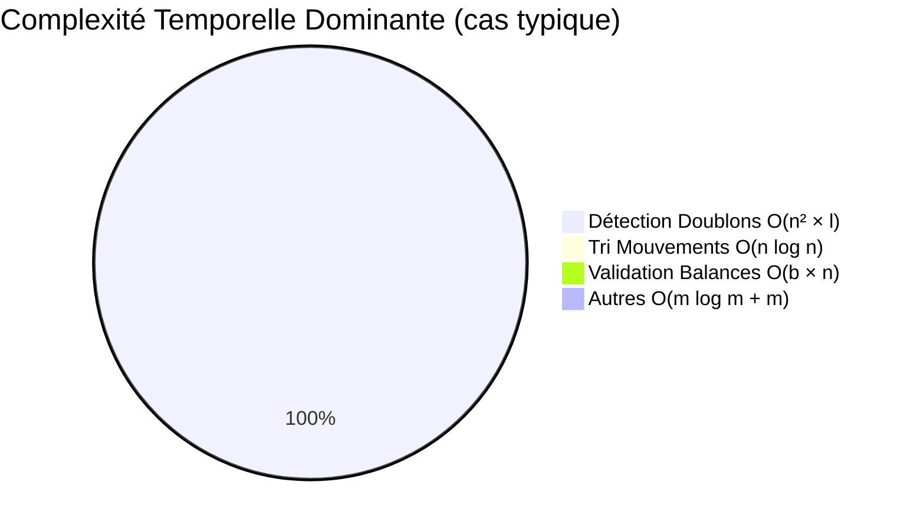

### 9.7 Recommandations

1. **Pour des volumes normaux** (n < 10,000) : L'algorithme actuel est performant
2. **Pour des volumes élevés** (n > 50,000) : Considérer l'optimisation de la détection de doublons
3. **Pour des volumes très élevés** (n > 500,000) : Nécessite une refactorisation majeure avec indexation et/ou parallélisation

---

## 🎓 Conclusion

### Points Clés de l'Approche

1. **Analyse méthodique** : Décomposition du problème en sous-problèmes
2. **Choix techniques justifiés** : Chaque décision a été réfléchie
3. **Focus utilisateur** : Messages d'erreur conçus pour faciliter le travail du comptable
4. **Code maintenable** : Architecture claire et tests pour garantir la qualité
5. **Itération** : Identification et correction des problèmes

### Apprentissages

- L'importance de valider tous les cas, y compris les cas limites (premier point de contrôle)
- La nécessité de tester avec des données réelles pour valider l'algorithme
- L'utilité d'une structure de réponse riche pour faciliter le travail manuel

### Perspectives

La solution actuelle répond aux exigences du test technique. Pour une mise en production, on pourrait envisager :

- Persistance des validations pour historique
- Interface utilisateur pour visualiser les anomalies
- Intégration avec les systèmes de comptabilité existants
- Optimisations pour de très gros volumes de données

---

_Document rédigé dans le cadre du test technique Dougs - Décembre 2025_
